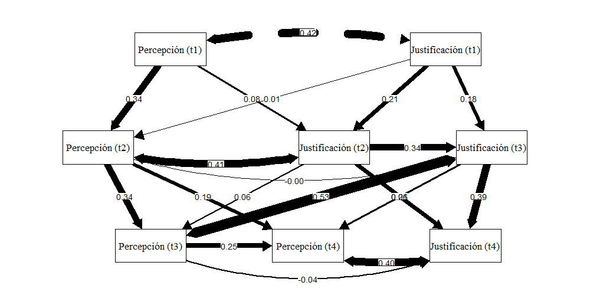

layout: true
class: animated, fadeIn

---
class: slideInRight, center, middle

# Antecedentes

---

* El estudio de la percepción y justificación de desigualdad económica empleando mediciones "indirectas" a través de salarios según ocupaciones (Kelley & Evans, 1993; Osberg & Smeeding, 2006)

* Estudios transversales han demostrado que la percepción predice fuertemente la justificación de desigualdad (Castillo et al., 2012; Castillo, 2011; Schröder, 2017)

* Evidencia experimental ha evidenciado que la desigualdad percibida incrementa la brecha justa (Stella-Trump, 2017)

* Para el caso de Chile, se ha evidenciado una disminución de las brechas percibidas y justas en 20 años, Pero una persistente asociación positiva entre brecha percibida y justa (Castillo et al., 2019).

---
class: middle, center 
#_¿De qué manera la percepción de desigualdad actual influencia la justificación de desigualdad futura?_
---
# Hipótesis

* $H_1$: La percepción de desigualdad presente se asocia positivamente con la justificación de desigualdad presente.   

* $H_2$: La percepción de desigualdad actual influencia la justificación de desigualdad futura. No así la justificación actual con la pecepción de desigualdad futura.
 
---
# Datos

* Se emplearon datos de las mediciones 2016, 2017, 2018 y 2019 del Estudio Social Longitudinal de Chile (ELSOC).

|Ola  | Según año |   Longitudinal|
|:----|----:      |----:          |
|2016 | 2535      | 1220          |
|2017 | 2064      | 1220          |
|2018 | 1992      | 1220          |
|2019 | 1818      | 1220          |

* Los resultados presentados corresponden a la base longitudinal (sujetos constantes por cada medición)

---
background-image: url(../output/images/items_elsoc.png)  
background-size: contain

# Variables principales
 
 
 
 
 
 
 
 
 

$$\text{Brecha salarial} = \ln\Bigg(\frac{\text{Salario Gerente}}{\text{Salario Obrero}}\Bigg)$$

---
# Métodos

* Análisis de regresión panel Cross-lagged. 
* Tanto las variables de percepción y de justificación se predicen en función de la medición anterior, además, se estiman "efectos" cruzados entre mediciones.
.center[  ] 

[allen2017](https://mikewk.com/clpm.pdf)

---

class: center, middle

## Resultados 1:
# Análisis descriptivo

---
# Salario percibido 
  

---
# Salario justo 
  

---
# Brecha salarial  
  

---
class: center, middle
  

---
class: center, middle 
## Resultados 2:
# Análisis longitudinal
---
class: bottom, right
background-image: url(../output/images/sempath02b.png)  
background-size: contain

---
class: inverse
# Conclusiónes preliminares

* La percepción es persistente en su asociación con la justificación de desigualdad.

* La brecha salarial percibida presente no muestra una asociación fuerte con la brecha justa futura, salvo entre medición 2016 y 2017. 

* ¿De qué manera el tiempo afecta la asociación? (análisis longitudinal multinivel)

---
class: center, middle

# _**Dinámicas de legitimación: Percepción de desigualdad actual y justificación de desigualdad futura**_

---
class: inverse, tiny

# Referencias

Castillo, J. C. (2011). Legitimacy of Inequality in a Highly Unequal Context: Evidence from the Chilean Case. Social Justice Research, 24(4), 314-340. https://doi.org/10.1007/s11211-011-0144-5]]

Castillo, J., Meneses, F., Iturra, J., & Maldonado, L. (2020). Cambios en la percepción y justificación de la desigualdad salarial en Chile. Análisis del año, 149-163.]

Castillo, J., Miranda, D., & Carrasco, D. (2012). Percepción de Desigualdad Económica en Chile: Medición, Diferencias y Determinantes. Psykhe (Santiago), 21(1), 99-114. https://doi.org/10.4067/S0718-22282012000100007]

Kelley, J., & Evans, M. D. R. (1993). The legitimation of inequality: Occupational earnings in nine nations. American Journal of Sociology, 99(1), 75-125.

---
class: inverse, tiny

Osberg, L., & Smeeding, T. (2006). “Fair” Inequality? Attitudes toward Pay Differentials: The United States in Comparative Perspective. American Sociological Review, 71(3), 450-473. https://doi.org/10.1177/000312240607100305]

Schröder, M. (2017). Is Income Inequality Related to Tolerance for Inequality? Social Justice Research, 30(1), 23-47. https://doi.org/10.1007/s11211-016-0276-8]

Trump, K. S. (2017). Income Inequality Influences Perceptions of Legitimate Income Differences. British Journal of Political Science, February, 1-24. https://doi.org/10.1017/S0007123416000326]

---
class: center, middle

Presentación creada via la librería de R [**xaringan**](https://github.com/yihui/xaringan).

Además de [remark.js](https://remarkjs.com), [**knitr**](http://yihui.name/knitr), y [R Markdown](https://rmarkdown.rstudio.com).

